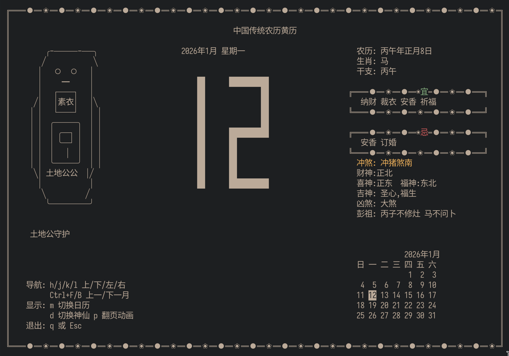

# 🏮 中国传统农历黄历

一个用 C 语言编写的终端中国风农历黄历。

为了测试和完善在 opencode 里新的 agent 和 skill，纯 vibe。



Claude 不让国内用那就不用，平常就用最一般的模型，这多锻炼人！就像任天堂和塞尔达。

主要根据下面的在 opencode 里根据自己的需求修改了一下

- Planning with Files

  https://github.com/OthmanAdi/planning-with-files

  WIL: just files and loops, no more complicated

  自己修改了一下，让每次的文件根据时间戳和 session title 保存

- code-simplifier

  https://github.com/anthropics/claude-plugins-official/blob/main/plugins/code-simplifier/agents/code-simplifier.md

  WIL: provide a specific ROLE to the agent, show the rules what agent shoud DO and DONOT

- Onboard

  https://github.com/ChrisWiles/claude-code-showcase/blob/main/.claude/commands/onboard.md

  WIL：provied a specific purpose with specific context before asking the agent to do anything

- skill-creator

  https://github.com/anthropics/skills/tree/main/skills/skill-creator

大厂和大型项目的 SKILL 都值得研究一下，句句都是浓缩的精华。

## ✨ 特性

- 📅 **农历公历互转** - 准确的农历转换，支持闰月
- 📖 **传统黄历** - 宜忌、冲煞、吉凶神位一应俱全
- 👹 **动画神仙头像** - 土地公、财神、灶王爷等，支持动画效果
- 🎯 **交互式操作** - 键盘导航，流畅操作
- 🔮 **易经算命** - 内置简单的算命功能
- 📝 **日历视图** - 可切换的日历显示模式

## 🚀 快速开始

```bash
make
```

```bash
./chinese-calendar
```

## 📁 项目结构

```
Chinese-Calendar/
├── src/
│   ├── calendar/     # 农历计算
│   ├── almanac/      # 黄历计算
│   ├── ui/           # 用户界面
│   │   ├── layout/   # 布局管理
│   │   ├── components/ # UI 组件
│   │   └── visual/   # 视觉元素（神仙头像、大数字等）
│   ├── ncurses/      # ncurses 封装
│   └── utils/        # 工具函数
├── tests/            # 测试文件
└── Makefile          # 构建配置
```

